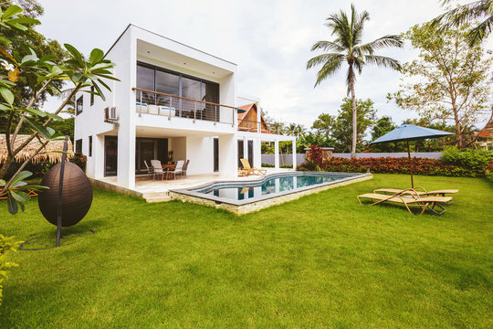
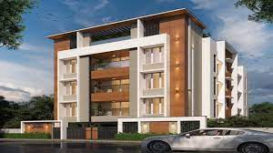
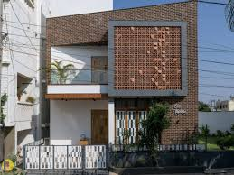

<!DOCTYPE html>
<html lang="en">
<head>
    <meta charset="UTF-8">
    <meta name="viewport" content="width=device-width, initial-scale=1.0">
    <title>Billa Real Estate</title>
    
</head>
<body>
    <header>
        <h1>Billa Real Estate</h1>
    </header>
    <nav>
        <a href="#">Home</a>
        <a href="#">Properties</a>
        <a href="#">About Us</a>
        <a href="#">Contact</a>
    </nav>
    

        

            <h2>Featured Properties</h2>
            

                
                

                    <h3>Beautiful Villa in subedari</h3>
                    
Location: subedari hanamakonda

                    
Price: 20,00,000

                

            

            

                
                

                    <h3>Luxury Apartment in Kazipet</h3>
                    
Location: Kazipet

                    
Price: 30,00,000

                

            

            

                
                

                    <h3>Spacious Family Home</h3>
                    
Location: warangal

                    
Price: 25,00,000

                

            

        

    

    <footer>
        
&copy; 2024 Billa Real Estate. All rights reserved.

    </footer>
</body>
</html>
